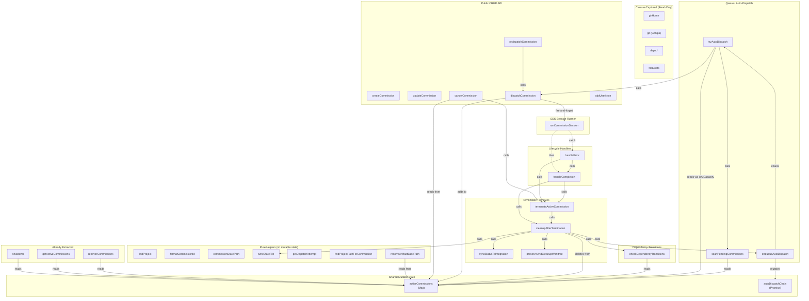

# Diagram: Commission Session Internals

## Context

`commission-session.ts` is ~1600 lines after extracting stateless helpers (state machine, capacity, recovery, SDK logging). The file header claims the remainder is "tightly coupled through the mutable activeCommissions Map and the autoDispatchChain." This diagram tests that claim by mapping which functions actually touch shared mutable state and which are pure operations that happen to live in the same closure.

The goal: find the right decomposition boundaries for extracting atomic operations while leaving the workflow orchestration in the parent file.

## Diagram: State Dependencies

## Diagram: Operation Categories

```mermaid
graph LR
    subgraph Stateful["Touches activeCommissions"]
        direction TB
        DC["dispatchCommission<br/>adds entry"]
        CAN["cancelCommission<br/>reads + delegates"]
        HC["handleCompletion<br/>deletes entry"]
        HE["handleError<br/>deletes entry"]
        CAT["cleanupAfterTermination<br/>deletes entry"]
        TAD["tryAutoDispatch<br/>reads via capacity"]
        SP["scanPendingCommissions<br/>reads for skip"]
        CDT["checkDependencyTransitions<br/>reads for skip"]
        RABP["resolveArtifactBasePath<br/>reads for routing"]
    end

    subgraph Stateless["No mutable state access"]
        direction TB
        CC["createCommission"]
        UC["updateCommission"]
        RD["redispatchCommission<br/>(calls dispatch)"]
        AN["addUserNote"]
        RCS["runCommissionSession"]
        SSI["syncStatusToIntegration"]
        PAC["preserveAndCleanupWorktree"]
        FP["findProject"]
        FCI["formatCommissionId"]
        CSP["commissionStatePath"]
        WSF["writeStateFile"]
        GDA["getDispatchAttempt"]
        FPFC["findProjectPathForCommission"]
    end
```

## Reading the Diagrams

**First diagram** maps which functions depend on mutable state and how they call each other. Solid arrows are synchronous calls; dashed arrows are fire-and-forget (the `.then()`/`.catch()` bridge between `runCommissionSession` and the lifecycle handlers).

**Second diagram** classifies every function by whether it touches `activeCommissions` or `autoDispatchChain`. Functions on the left mutate or read shared state. Functions on the right could be extracted without breaking any state invariant.

## Key Insights

**The coupling is narrower than the file header claims.** The header says "CRUD operations, lifecycle handlers, queue/auto-dispatch, and dependency transitions are tightly coupled through the mutable activeCommissions Map." In practice:

- `createCommission`, `updateCommission`, `addUserNote` never touch `activeCommissions` at all
- `redispatchCommission` only touches it indirectly (it calls `dispatchCommission`)
- `runCommissionSession` doesn't touch it directly (it mutates the `ActiveCommission` object it receives, but doesn't read or write the Map)
- `syncStatusToIntegration`, `preserveAndCleanupWorktree`, `writeStateFile` are pure operations that take explicit parameters

**Three natural module boundaries emerge:**

1. **CRUD operations** (`createCommission`, `updateCommission`, `addUserNote`, `redispatchCommission`): artifact reads/writes against the integration worktree. No mutable state. Need `ghHome`, `git`, `config`, and the artifact helpers. `redispatchCommission` needs `dispatchCommission` as a callback.

2. **Queue engine** (`scanPendingCommissions`, `tryAutoDispatch`, `enqueueAutoDispatch`, `checkDependencyTransitions`): reads `activeCommissions` but never writes to it. Needs `activeCommissions` as a read-only view, `config`, `ghHome`, `fileExists`, and `dispatchCommission` as a callback. The `autoDispatchChain` is internal to this module.

3. **Session lifecycle** (`dispatchCommission`, `runCommissionSession`, `handleCompletion`, `handleError`, `cancelCommission`, `terminateActiveCommission`, `cleanupAfterTermination`): owns `activeCommissions` writes. This is the true stateful core.

**The cycle problem is real but solvable.** `tryAutoDispatch` calls `dispatchCommission`, and `dispatchCommission`'s termination path calls `enqueueAutoDispatch`. This creates a cycle between the queue engine and the session lifecycle. The solution is a callback: the queue engine accepts a `dispatch` function, and the lifecycle module accepts an `enqueueAutoDispatch` function. Each module owns its side of the interface.

**Pure helpers are already extractable.** `findProject`, `formatCommissionId`, `commissionStatePath`, `writeStateFile`, `getDispatchAttempt`, `findProjectPathForCommission`, `resolveArtifactBasePath` are all pure functions that only need closure-captured read-only values. These could move to a `commission-helpers.ts` without any structural change.

## Not Shown

- The `ActiveCommission` object's internal mutations (e.g., `commission.lastActivity = new Date()` inside `runCommissionSession`). These are per-entry mutations, not Map-level state changes.
- Error handling paths within each function. The diagram shows the happy path call graph.
- The EventBus subscription inside `runCommissionSession` (subscribes on entry, unsubscribes in `finally`). This is a local lifecycle, not shared state.
- The `withProjectLock` serialization in `handleCompletion`'s merge path. This is an external lock, not internal mutable state.
- The `deps.commissionSessionRef` circular reference (the session exposes an interface that the manager toolbox uses to create commissions). This is a DI concern, not a decomposition concern.

## Related

- `.lore/design/process-architecture.md` for the overall daemon design
- `.lore/ideas/2026-02-28.md` for the decomposition idea that prompted this
