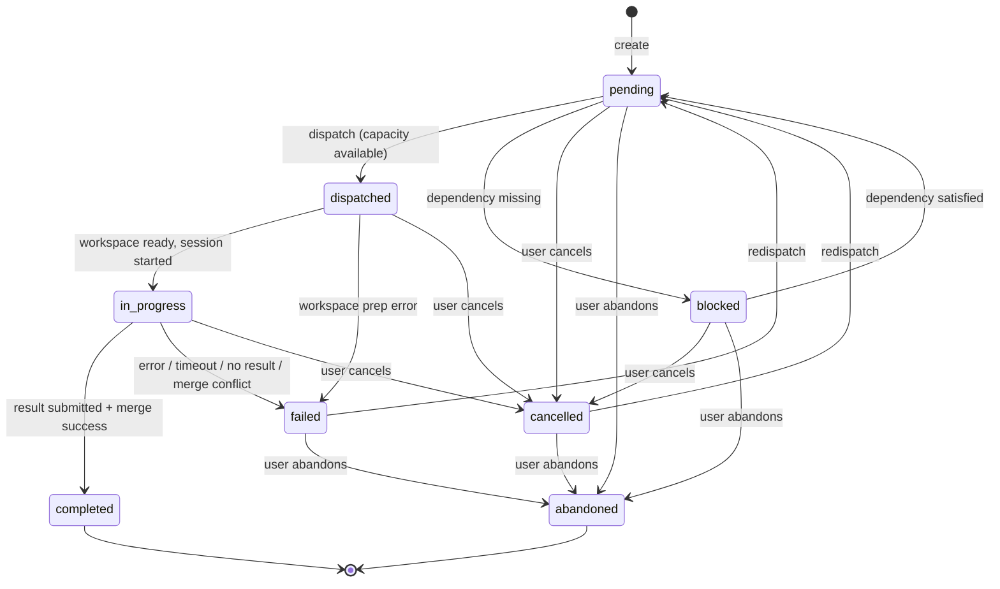
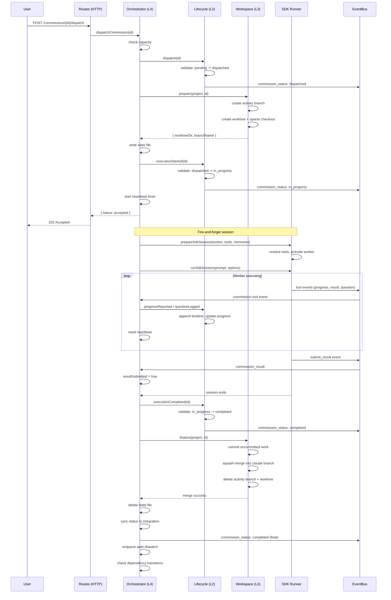
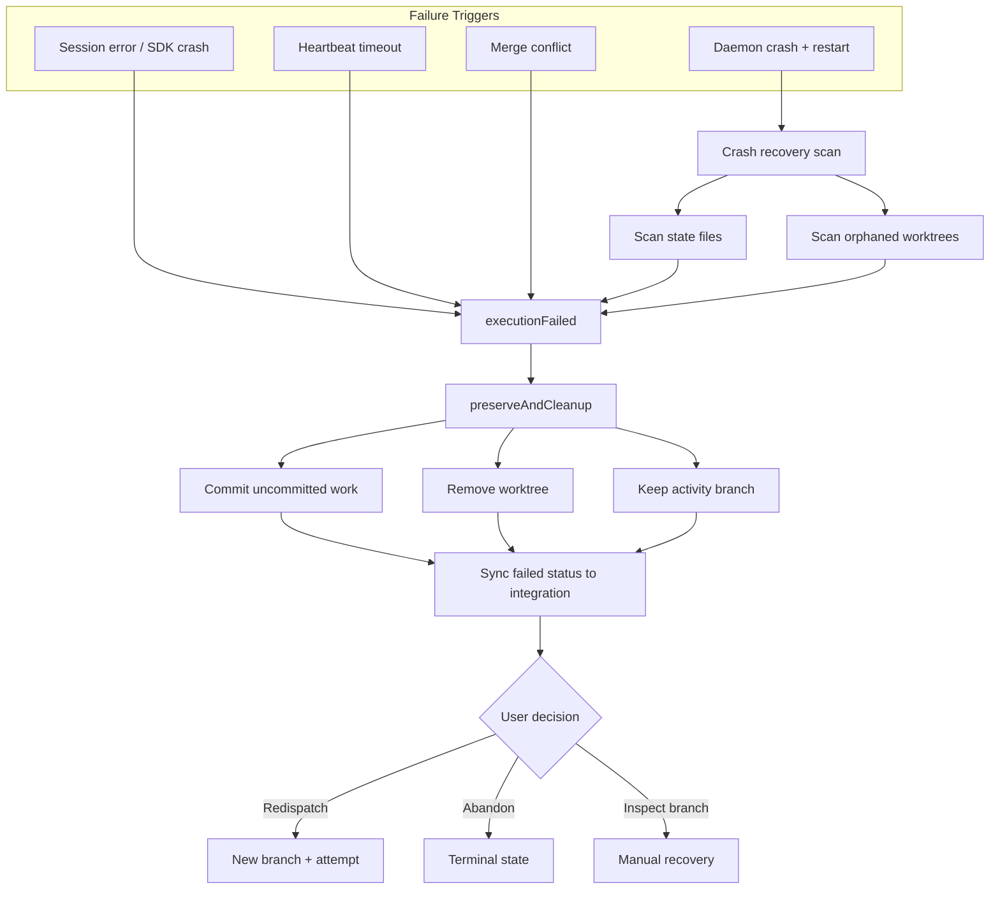
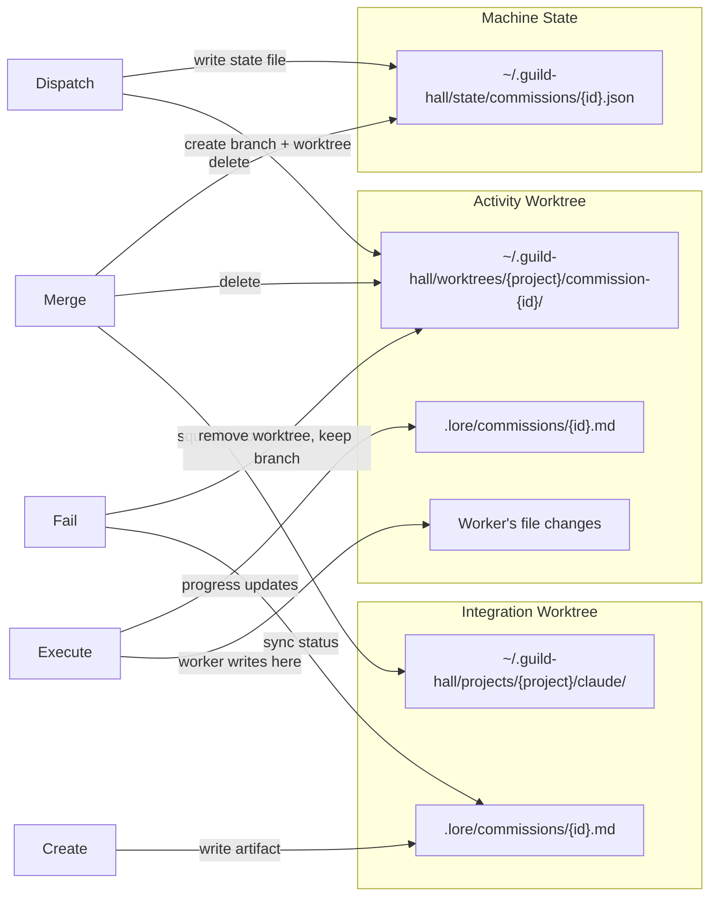
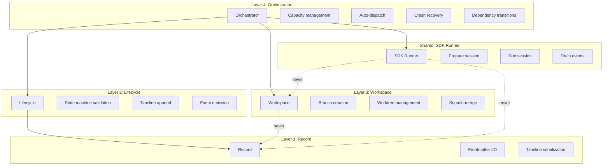

# Diagram: Commission Lifecycle

## Context

Commissions are the primary unit of delegated work in Guild Hall. A commission moves through eight states across four layers (record, lifecycle, workspace, orchestrator) plus a shared SDK runner. This diagram answers: what happens from the moment a commission is created until it reaches a terminal state, and which layer owns each transition?

## State Machine

The eight states and their valid transitions. Terminal states are `completed` and `abandoned`.

### State Ownership

| State | Who triggers the transition |
|-------|---------------------------|
| pending | Orchestrator (create, redispatch, dependency satisfied) |
| blocked | Orchestrator (dependency check) |
| dispatched | Orchestrator (dispatch call) |
| in_progress | Orchestrator (after workspace.prepare succeeds) |
| completed | Lifecycle (executionCompleted signal) |
| failed | Lifecycle (executionFailed signal) |
| cancelled | Lifecycle (cancel call from routes or manager) |
| abandoned | Lifecycle (abandon call from routes) |

## Dispatch-to-Completion Flow

The sequence from when a user dispatches a commission through successful completion. This is the "happy path" showing all four layers and the SDK runner.

## Failure and Recovery

What happens when things go wrong. Three failure paths converge on the same preservation strategy.

## Git Isolation

Three locations involved in a commission's git lifecycle, and when each is written.

## Layer Boundaries

How the five concerns map to commission operations. Each layer has a hard boundary: it only touches its own domain.

## Reading the Diagram

The state machine (first diagram) is the contract. All other flows are implementations of transitions in that state machine.

The dispatch-to-completion sequence shows the "normal" case. Every participant maps to a specific module in `daemon/services/commission/`. The orchestrator is the only module that talks to all layers; layers never cross-reference each other.

The failure flowchart shows that all failure paths converge: commit partial work, remove the worktree, keep the branch. This is deliberate. No work is ever silently lost.

## Key Insights

- **Dispatched is transient.** The gap between `dispatched` and `in_progress` is just workspace preparation (branch + worktree creation). If that fails, the commission goes directly to `failed` without ever running the SDK.
- **Result submission is the fork.** The session ending with `resultSubmitted = true` goes to `completed`; without it, `failed`. The worker must explicitly call `submit_result` for success.
- **Merge conflict is a failure, not a block.** When a squash-merge has non-`.lore/` conflicts, the commission fails and the Guild Master is asked to help. The branch is preserved for manual resolution.
- **Crash recovery is pessimistic.** On restart, every interrupted commission becomes `failed`. No attempt to resume. The user can redispatch, which creates a fresh branch (with attempt suffix) while preserving the old one.
- **Heartbeat prevents zombies.** A 3-minute timeout (reset on any tool call) catches sessions where the SDK hangs or the worker loops without producing output.

## Not Shown

- **Dependency auto-transition details.** When an artifact is created or removed, the orchestrator scans all blocked/pending commissions. The scan logic and matching rules aren't visualized here.
- **Capacity queuing internals.** When at capacity, commissions stay pending and auto-dispatch fires when capacity opens. The FIFO ordering and queue management aren't shown.
- **Manager worker's programmatic commission creation.** The Guild Master can create and dispatch commissions through the same interface as routes, but the coordination logic (batching, sequencing) lives in the manager worker's posture.
- **EventBus subscription lifecycle.** How SSE clients subscribe, receive events, and reconnect.
- **Toolbox resolution.** How base, context, system, and domain toolboxes compose for a commission. This deserves its own diagram.

## Related

- `.lore/specs/commissions.md` for requirements and REQ IDs
- `.lore/specs/system.md` for system-level architecture
- `daemon/services/commission/orchestrator.ts` for Layer 4 implementation
- `daemon/services/commission/lifecycle.ts` for the state machine
- `daemon/services/commission/workspace.ts` for git isolation
- `daemon/services/sdk-runner.ts` for the shared session infrastructure
