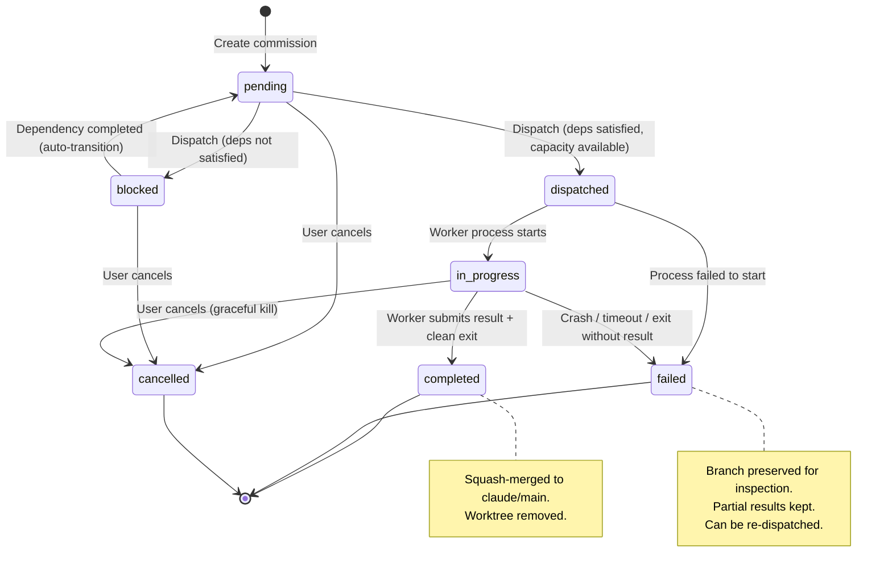
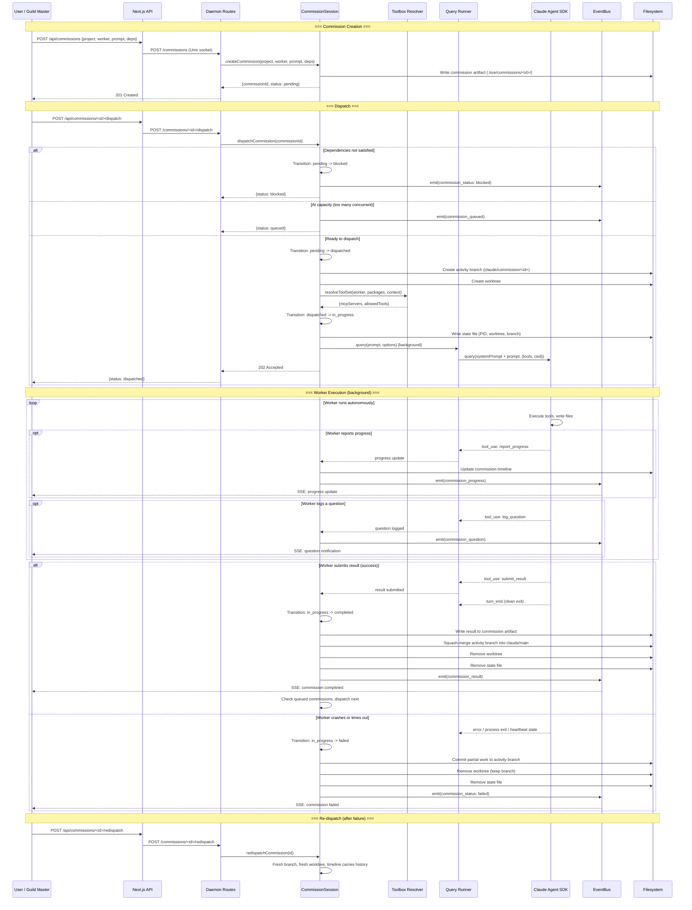
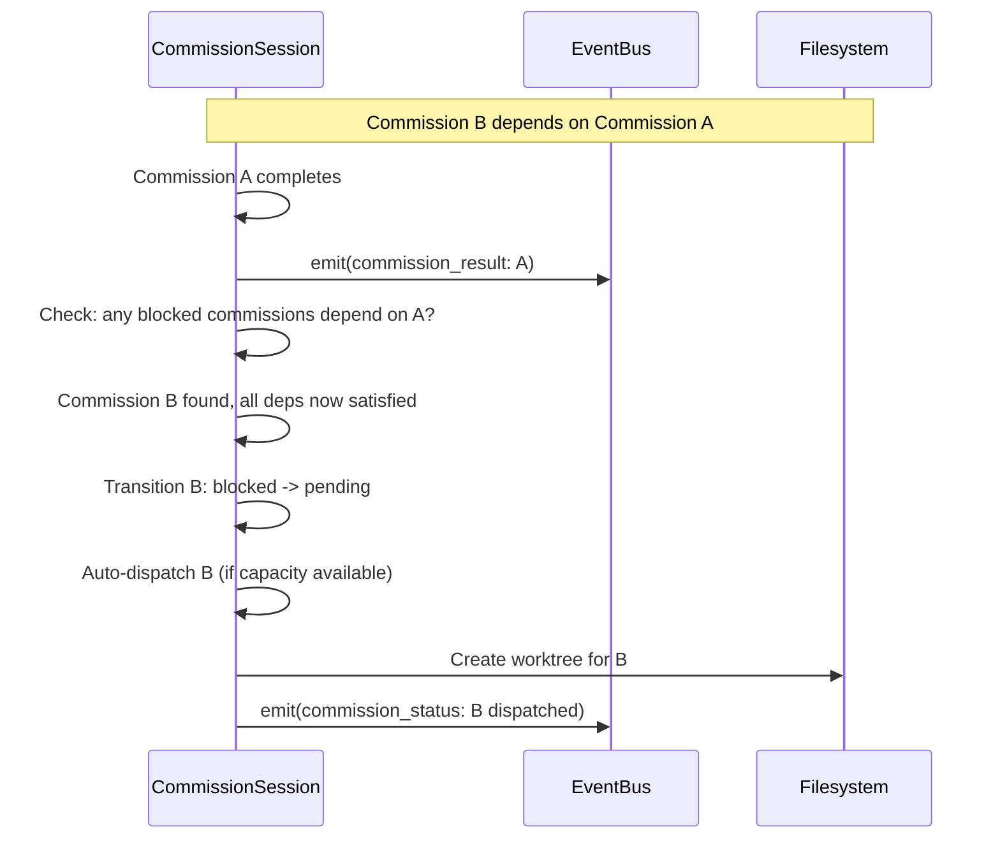
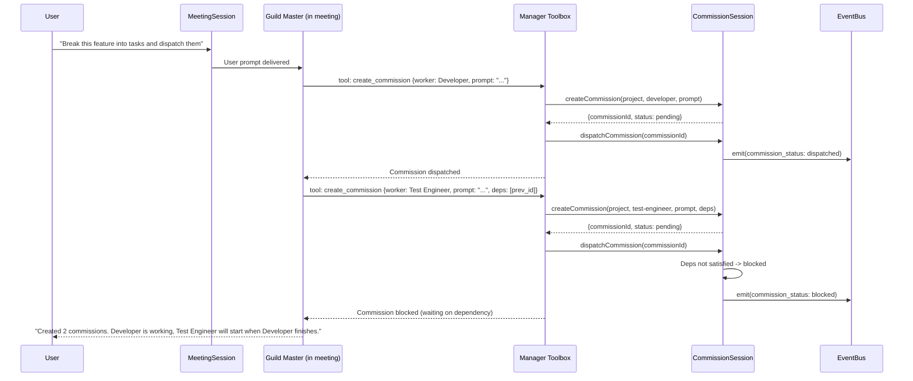

# Diagram: Commission Session Lifecycle

## Context

Commissions are autonomous work units dispatched to workers. Unlike meetings (interactive, multi-turn), commissions run to completion without user input. They have a state machine with dependency tracking, capacity management, and crash recovery. This diagram covers creation, dispatch, execution, and the state machine.

## State Machine

## Dispatch and Execution Flow

## Dependency Auto-Transition

## Manager Creates Commission (Guild Master Flow)

## Reading the Diagrams

**Commissions are fire-and-forget.** Unlike meetings, the user doesn't send follow-up messages. The worker runs autonomously and reports progress via the commission toolbox (report_progress, log_question, submit_result). The user watches via SSE events.

**The state machine has two interesting paths.** The happy path (pending -> dispatched -> in_progress -> completed) is straightforward. The interesting path is dependency blocking: a commission can be dispatched but transition to `blocked` if its dependencies aren't complete. When a dependency completes, the blocked commission auto-transitions to `pending` and auto-dispatches.

**The Guild Master is the orchestrator.** In a meeting, the Guild Master uses the manager toolbox to create and dispatch commissions, chain them with dependencies, and report back to the user. This is the primary way complex work gets decomposed: user describes what they want, Guild Master breaks it into commissions across workers.

**Capacity management is FIFO.** When the concurrent commission limit is reached, new dispatches queue up. When a slot opens (commission completes or fails), the next queued commission dispatches automatically.

## Key Insights

- Commissions run as background SDK sessions (non-blocking to the HTTP request that dispatched them). The daemon returns 202 Accepted immediately.
- Failed commissions keep their activity branch for inspection. The timeline artifact records what happened. Re-dispatch creates a fresh branch and worktree but carries the timeline history forward.
- The manager toolbox is the bridge between meetings and commissions. It's only available to the Guild Master, enforcing the coordination model.
- Progress reports double as heartbeats. If no report_progress call arrives within the staleness threshold (180s), the commission is considered stale/failed.

## Not Shown

- Specific tools available to workers during execution
- Memory injection and worker activation details (see system architecture diagram)
- Sparse checkout configuration per worker
- PR creation flow (manager toolbox's create_pr tool)
- User adding notes to in-progress commissions

## Related

- [Commission Spec](.lore/specs/guild-hall-commissions.md): full requirements and REQ IDs
- [System Architecture](.lore/diagrams/system-architecture.md): where commissions fit in the overall system
- [Meeting Lifecycle](.lore/diagrams/meeting-lifecycle.md): the interactive session type
