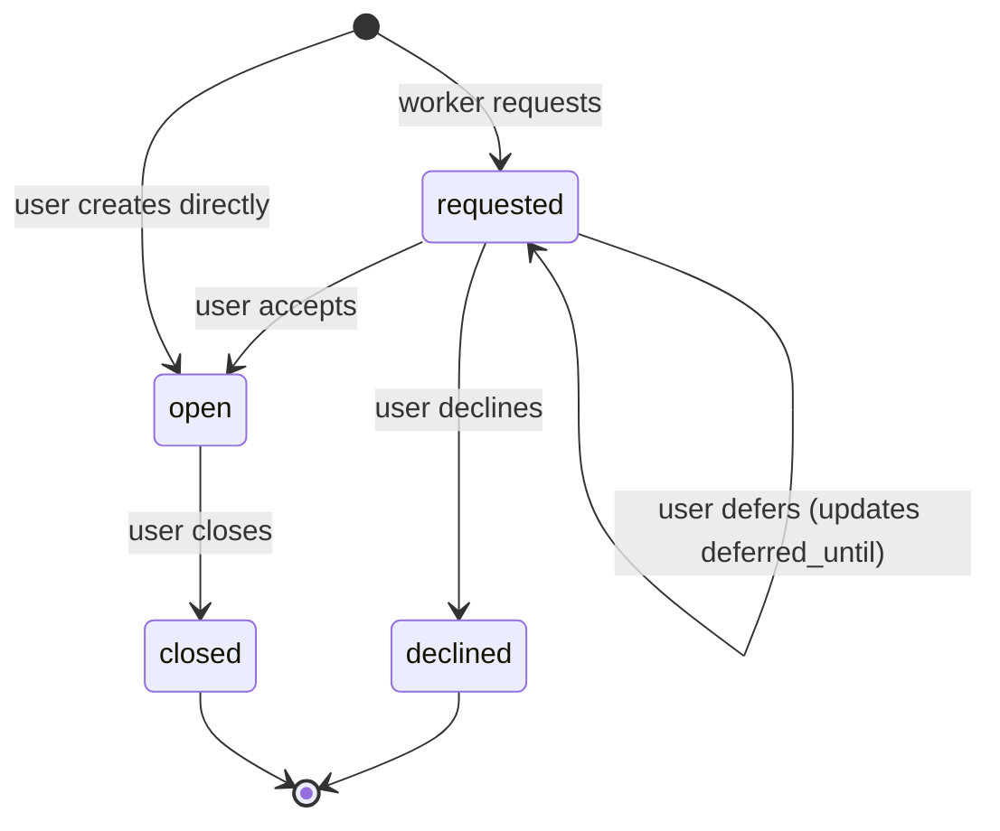
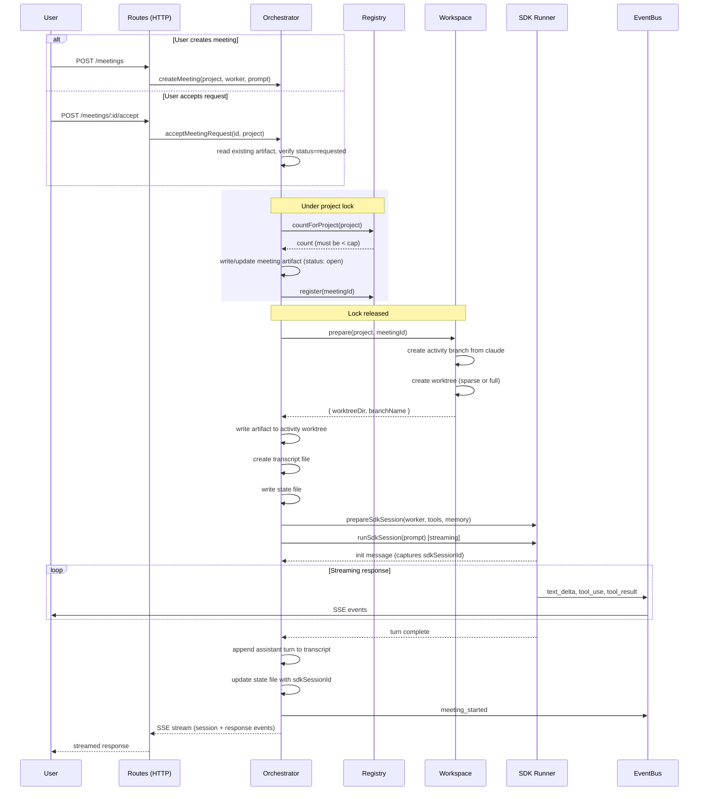
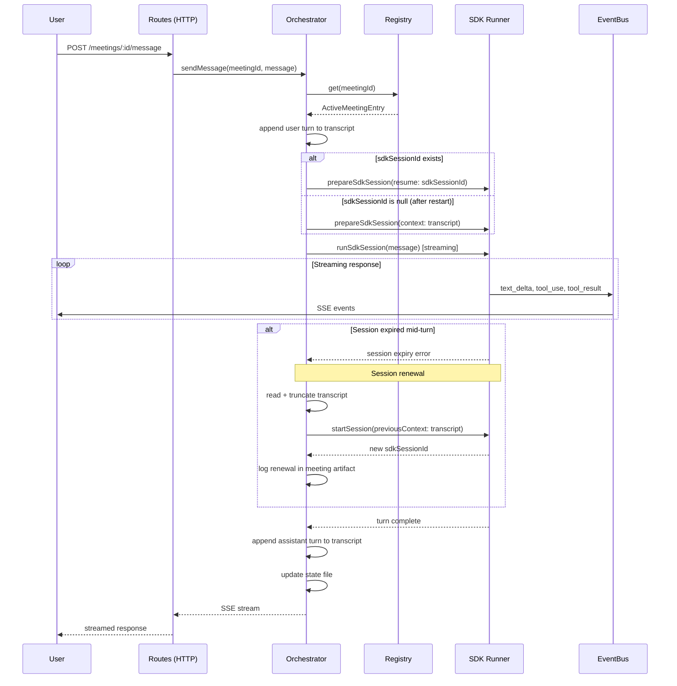
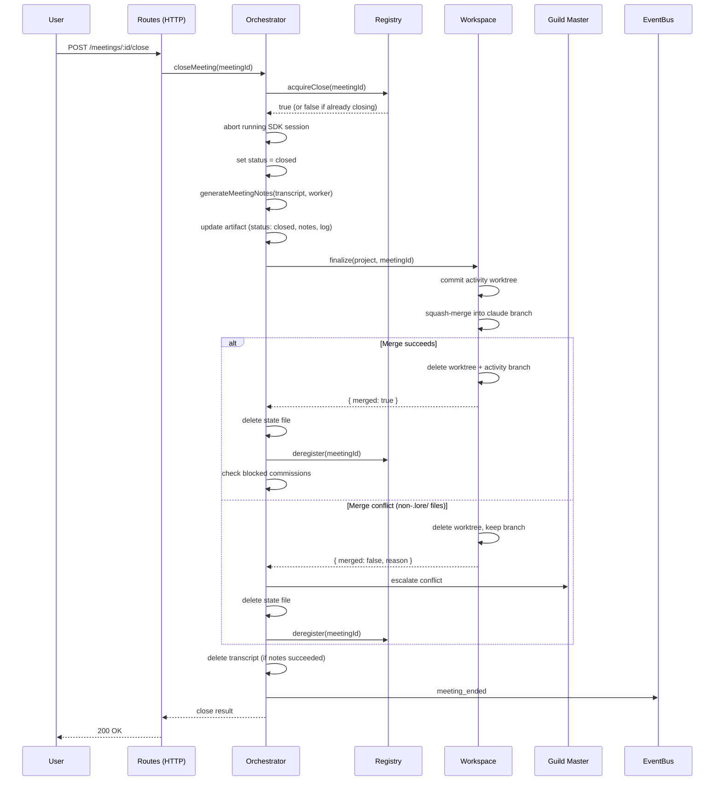
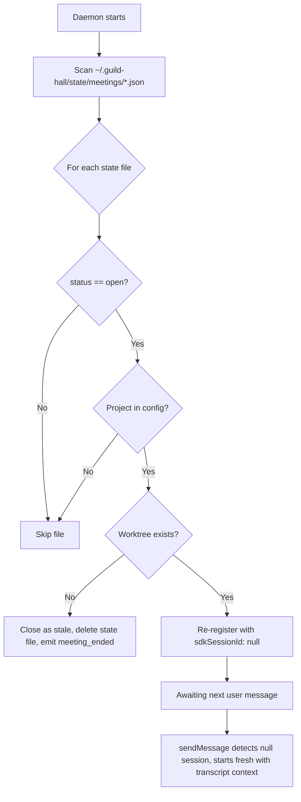
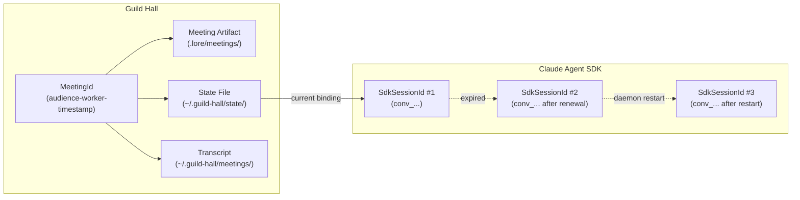

# Diagram: Meeting Lifecycle

## Context

Meetings are synchronous, multi-turn interactions between a user and a worker. Unlike commissions (fire-and-forget), meetings stream responses in real time and persist conversation state across SDK sessions. This diagram answers: how does a meeting move from creation to close, what happens during each turn, and how does crash recovery restore state?

## State Machine

Four states. Two entry paths (user-initiated skips `requested`). Two terminal states.

### State Ownership

| State | Who triggers the transition |
|-------|---------------------------|
| requested | Worker or Guild Master creates meeting artifact |
| open | User (createMeeting or acceptMeetingRequest) |
| closed | User (closeMeeting) |
| declined | User (declineMeeting) |

## Create and Accept Flow

Two paths into `open`. User-created meetings skip the request phase entirely; accepted meetings read an existing artifact.

## Multi-Turn Conversation

Each user message is a new HTTP request. The SDK session is resumed when possible, renewed when expired.

## Close Meeting

User-initiated close. Notes generation, artifact update, workspace merge, cleanup.

## Crash Recovery

On daemon restart, open meetings are re-registered with null session IDs. The next user message starts a fresh SDK session with transcript context.

## Two ID Namespaces

One meeting can have multiple SDK sessions over its lifetime. These IDs must never be mixed.

## Reading the Diagram

The state machine is small (four states, two terminal) because meetings are user-driven. The user opens, the user closes. Workers can request meetings, but only users can accept them.

The sequence diagrams show the three HTTP operations that drive the lifecycle: create/accept (opens), message (each turn), close (merges and cleans up). Each operation is a separate request/response with SSE streaming for real-time events.

The crash recovery flowchart shows the pessimistic approach: SDK sessions are inherently transient, so after a restart, all sessions are lost. The transcript file provides continuity by feeding prior conversation into a fresh session.

## Key Insights

- **No background execution.** Unlike commissions, meetings never run without the user watching. Every SDK call is triggered by a user action (create, accept, message). This makes the lifecycle simpler but adds the session persistence challenge.
- **Session renewal is transparent.** When an SDK session expires mid-turn, the orchestrator silently starts a fresh session with truncated transcript context. The user sees no interruption.
- **Concurrent close guard prevents double cleanup.** `acquireClose()` returns false if a close is already in progress, preventing the race between error-triggered and user-initiated closes from executing cleanup twice.
- **Transcript survives merge failures.** If notes generation fails, the transcript is preserved so the user can manually review the conversation. It's only deleted after successful notes generation.
- **Cap enforcement is atomic.** The count check and registration happen under a project lock, preventing two concurrent create/accept calls from both passing the cap check.

## Not Shown

- **Meeting toolbox details.** Workers have `link_artifact`, `propose_followup`, and `summarize_progress` tools. The tool resolution and composition aren't visualized here.
- **Notes generation internals.** How the transcript is summarized into meeting notes (decisions, artifacts produced, action items).
- **Decline and defer flows.** These are simple artifact updates with no workspace, git, or SDK involvement.
- **EventBus subscription lifecycle.** How SSE clients subscribe, receive events, and reconnect.
- **Worker activation and memory loading.** How the SDK session is configured with worker identity, posture, and memory context.
- **Integration worktree lock contention.** Multiple meetings for the same project share the integration worktree lock during merge.

## Related

- `.lore/specs/meetings/guild-hall-meetings.md` for requirements and REQ IDs
- `.lore/specs/infrastructure/guild-hall-system.md` for system-level architecture
- `.lore/diagrams/commission-lifecycle.md` for the commission equivalent
- `apps/daemon/services/meeting/orchestrator.ts` for the orchestration implementation
- `apps/daemon/services/meeting/registry.ts` for cap enforcement and close guard
- `apps/daemon/services/workspace.ts` for git isolation
- `apps/daemon/services/sdk-runner.ts` for the shared session infrastructure
