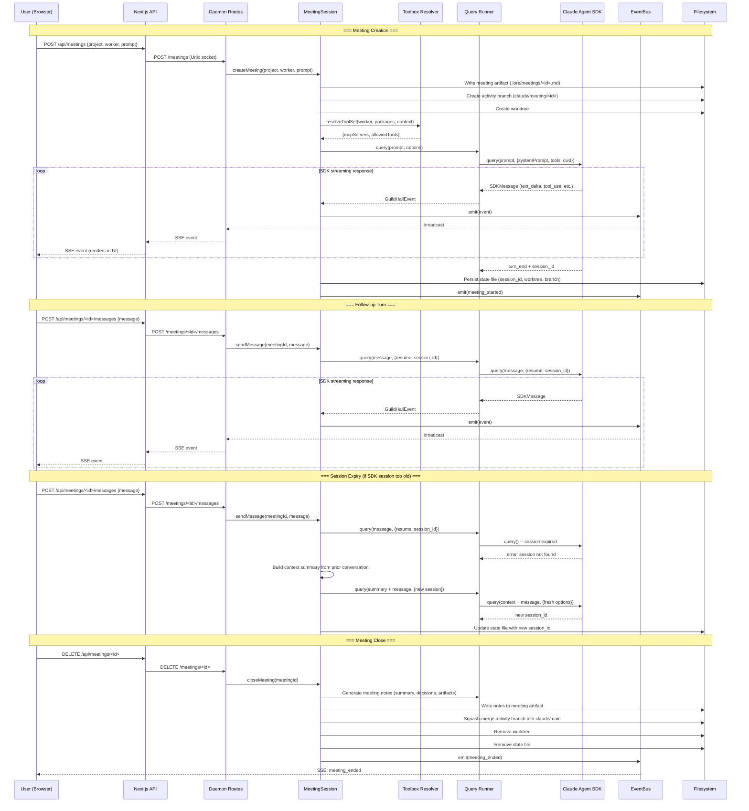
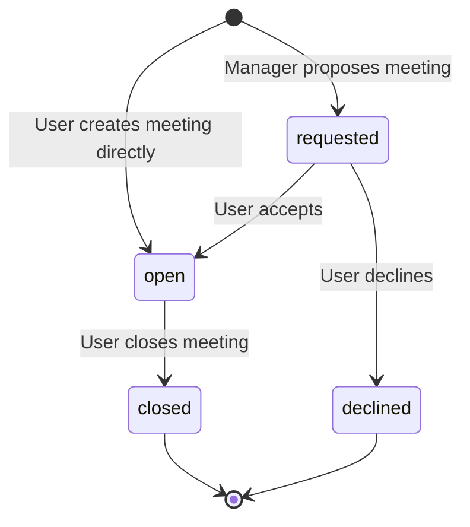

# Diagram: Meeting Session Lifecycle

## Context

Meetings are interactive, multi-turn conversations between a user and a worker. They persist across daemon restarts via SDK session resumption. This diagram traces the full lifecycle: creation, conversation turns, and close.

## Diagram

## State Transitions

## Reading the Diagram

**Two creation paths.** Users can create meetings directly (starts as `open`) or the Guild Master can propose a meeting via the manager toolbox (starts as `requested`, user must accept).

**SDK session persistence is the key mechanism.** Each meeting stores a `session_id` from the Claude Agent SDK. Follow-up messages use `resume: session_id` to continue the same conversation context. This persists across daemon restarts because the SDK stores session state server-side.

**Session expiry is handled gracefully.** If the SDK session is too old to resume, the meeting session builds a context summary from the prior conversation and starts a fresh SDK session, injecting the summary so the worker has continuity.

**Streaming is end-to-end.** SDK messages flow through the query runner, meeting session, EventBus, daemon routes, Next.js API proxy, and into the browser as SSE events. Every layer passes through without buffering.

## Key Insights

- Meeting artifacts (`.lore/meetings/<id>.md`) are the durable record. State files (`~/.guild-hall/state/meetings/<id>.json`) are machine-local recovery state only.
- The activity worktree gives the worker an isolated workspace. Any file changes during the meeting are committed to `claude/meeting/<id>` and squash-merged on close.
- Interruption (`POST /meetings/<id>/interrupt`) cancels the current SDK generation via AbortController but keeps the meeting open.
- Workers in meetings get the meeting toolbox automatically (link_artifact, propose_followup, summarize_progress) via the toolbox resolver's context-based auto-add.

## Not Shown

- Meeting request flow (manager proposes, user accepts/declines/defers)
- Quick-comment injection during active generation
- Specific tool calls the worker makes during the meeting
- Memory injection at activation time

## Related

- [Meeting Spec](.lore/specs/guild-hall-meetings.md): full requirements
- [System Architecture](.lore/diagrams/system-architecture.md): where meetings fit in the overall system
- [Commission Lifecycle](.lore/diagrams/commission-lifecycle.md): the other session type
