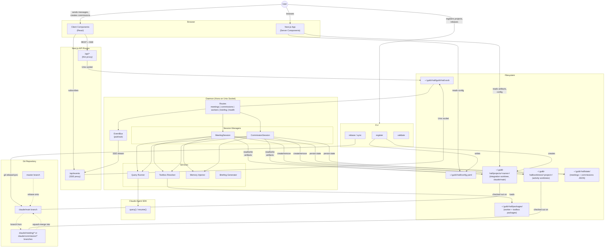

# Diagram: System Architecture Overview

## Context

Guild Hall has three entry points (CLI, Next.js web UI, daemon API) that coordinate through a Unix socket daemon and a shared filesystem. This diagram shows how the layers connect and where state lives.

## Diagram

## Reading the Diagram

**Three entry points, one daemon.** The CLI handles project registration and git operations directly. The web UI reads artifacts from the filesystem (server components) and proxies interactive requests through Next.js API routes to the daemon. The daemon owns all write operations, session management, and the EventBus.

**Unix socket is the boundary.** Everything interactive (creating meetings, dispatching commissions, streaming events) flows through the daemon's Unix socket. The Next.js API routes are thin proxies that translate HTTP to Unix socket requests and handle daemon-offline errors.

**Two worktree types.** Integration worktrees on `claude/main` are the stable read source for the UI. Activity worktrees on ephemeral branches (`claude/meeting/*`, `claude/commission/*`) isolate active session work. On completion, activity branches squash-merge into `claude/main`.

**EventBus bridges daemon to browser.** The daemon emits events (commission progress, meeting started, etc.) to a set-based pub/sub bus. The browser subscribes via SSE through `/api/events`, which proxies the daemon's `/events` stream.

## Key Insights

- Server components read from the filesystem directly (no daemon round-trip for page loads). This means the UI works even when the daemon is down, just without interactive features.
- The CLI and daemon both write to `config.yaml`, but the CLI handles project registration while the daemon handles runtime state.
- Worker packages live on disk and are discovered at daemon startup. The toolbox resolver assembles the complete tool set per session from base + context + system + domain toolboxes.
- State files (`~/.guild-hall/state/`) enable crash recovery. The daemon rebuilds in-memory state from these on restart.

## Not Shown

- Error handling and graceful degradation paths
- Authentication (there is none; local-only system)
- Specific toolbox tool definitions
- Memory compaction and worker memory scopes
- Briefing generation flow

## Related

- [Process Architecture](.lore/design/process-architecture.md): deeper architectural rationale
- [Meeting Lifecycle](.lore/diagrams/meeting-lifecycle.md): sequence diagram for meeting sessions
- [Commission Lifecycle](.lore/diagrams/commission-lifecycle.md): sequence diagram and state machine for commissions
