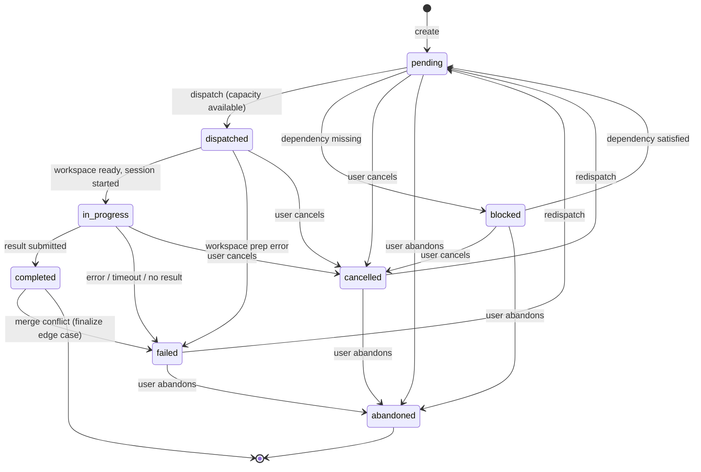
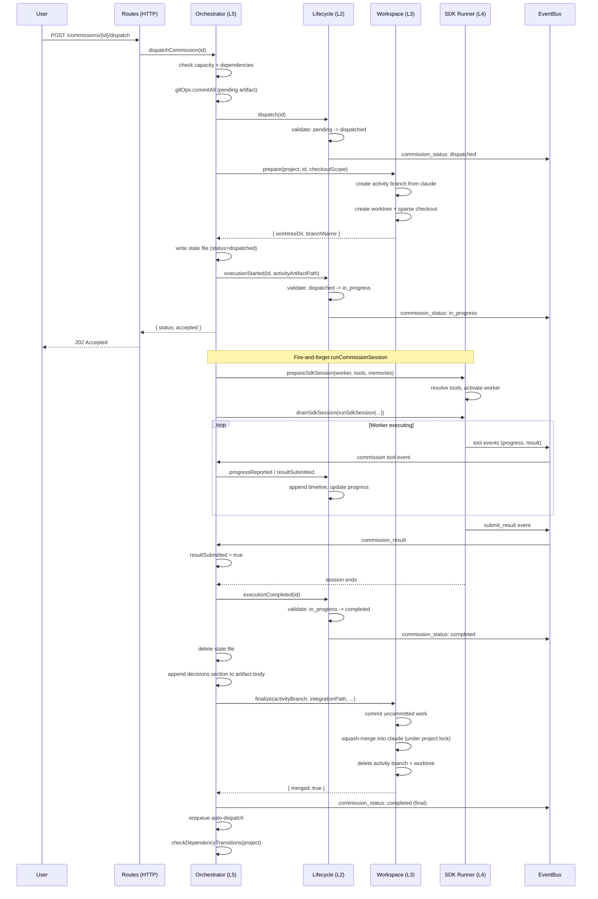
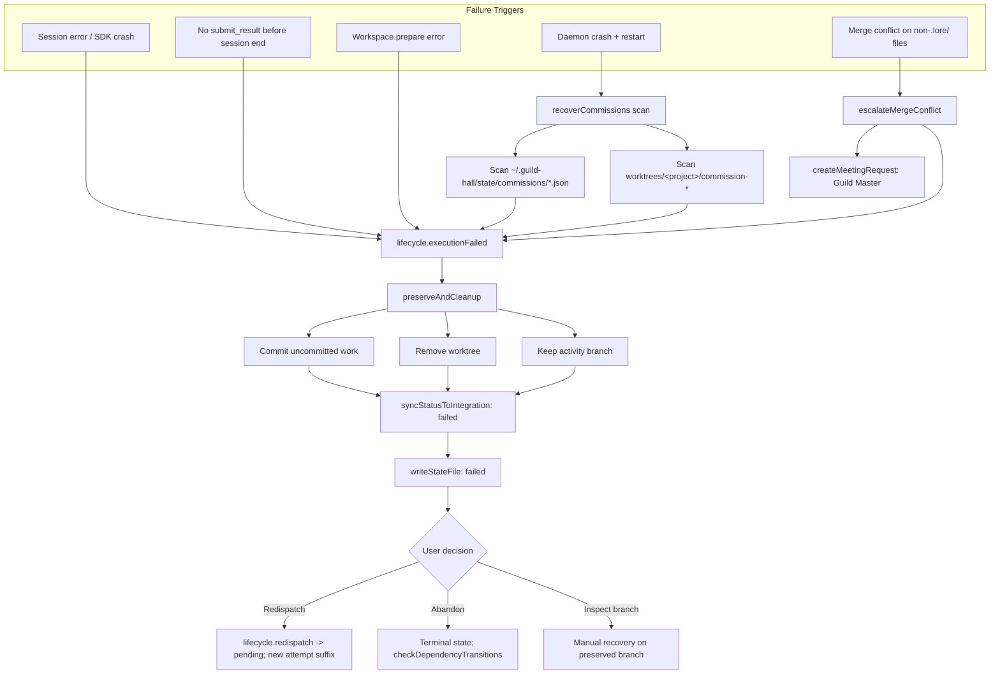
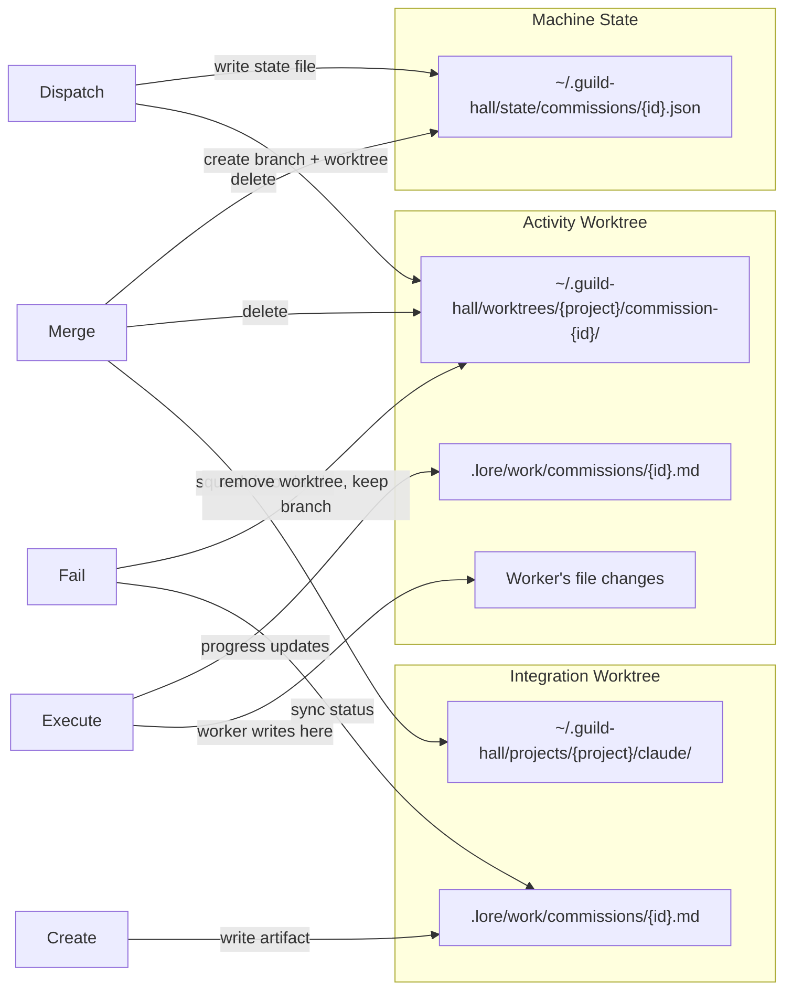
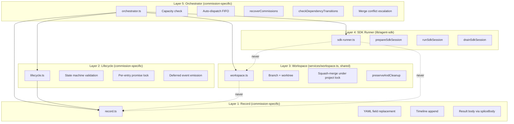

# Diagram: Commission Lifecycle

## Context

Commissions are the primary unit of delegated work in Guild Hall. A commission moves through eight states across five layers (record, lifecycle, workspace, sdk-runner, orchestrator). This diagram answers: what happens from the moment a commission is created until it reaches a terminal state, and which layer owns each transition?

## State Machine

The eight states and their valid transitions. Terminal states are `completed` and `abandoned`.

The `completed -> failed` edge exists because `lifecycle.executionCompleted` runs before `workspace.finalize`. If the squash-merge then conflicts on non-`.lore/` files, the commission is already in `completed` and must transition forward to `failed`. This is the only edge that leaves a "terminal" state.

### State Ownership

| State | Who triggers the transition |
|-------|---------------------------|
| pending | Orchestrator L5 (create, redispatch, dependency satisfied) |
| blocked | Orchestrator L5 (dependency check) |
| dispatched | Orchestrator L5 (dispatch call) |
| in_progress | Orchestrator L5 (after workspace.prepare succeeds) |
| completed | Lifecycle L2 (executionCompleted signal from orchestrator) |
| failed | Lifecycle L2 (executionFailed; from session error, no result, finalize merge conflict, or recovery) |
| cancelled | Lifecycle L2 (cancel call from routes or manager) |
| abandoned | Lifecycle L2 (abandon call from routes) |

## Dispatch-to-Completion Flow

The sequence from when a user dispatches a commission through successful completion. This is the "happy path" showing the orchestrator coordinating across all four lower layers.

## Failure and Recovery

What happens when things go wrong. Most failure paths converge on the same preservation strategy; the merge-conflict path branches off because the worktree was already removed by `finalize`.

The merge-conflict path is unique: `workspace.finalize` already removed the worktree before returning a conflict result, so `failAndCleanup` skips `preserveAndCleanup` (controlled by the `preserveWorktree: false` option). The branch is preserved by `finalize`'s own conflict-abort path, and `escalateMergeConflict` opens a Guild Master meeting so a human can resolve.

## Git Isolation

Three locations involved in a commission's git lifecycle, and when each is written.

## Layer Boundaries

How the five concerns map to commission operations. Each layer has a hard boundary: it only touches its own domain.

Workspace was extracted from the commission tree into `apps/daemon/services/workspace.ts` because the meeting orchestrator uses the same primitives. It has no commission types in scope. The orchestrator is the only module that imports all four lower layers (record's `addUserNote` writes go directly through Layer 1 because they're not state transitions).

## Reading the Diagram

The state machine (first diagram) is the contract. All other flows are implementations of transitions in that state machine.

The dispatch-to-completion sequence shows the "normal" case. The orchestrator is the only module that talks to all layers; layers never cross-reference each other. Workspace and SDK Runner are not commission-specific — `services/workspace.ts` is shared with the meeting orchestrator, and `lib/agent-sdk/sdk-runner.ts` runs any SDK session.

The failure flowchart shows that almost all failure paths converge: commit partial work, remove the worktree, keep the branch, sync status to integration, write the failed state file. The merge-conflict path is the exception — `workspace.finalize` already removed the worktree, so the orchestrator skips `preserveAndCleanup` and instead opens a Guild Master meeting via `escalateMergeConflict`.

## Key Insights

- **Dispatched is transient.** The gap between `dispatched` and `in_progress` is just `workspace.prepare` (branch + worktree creation, optional sparse checkout). If that fails, the commission goes directly to `failed` without ever running the SDK.
- **Completed is mostly terminal — but not always.** `lifecycle.executionCompleted` runs *before* the squash-merge, so a non-`.lore/` merge conflict transitions an already-completed commission to `failed`. This is the only edge that leaves a "terminal" state, and it exists by design: the commission really did finish its work; the failure is in integration, not execution.
- **Result submission is the fork.** The session ending with `resultSubmitted = true` goes to `completed`; without it, `failed` with reason "Session completed without submitting result". A worker that finishes its prompt but never calls `submit_result` did not finish the commission.
- **Merge conflict is a failure plus an escalation.** When a squash-merge has non-`.lore/` conflicts, the commission fails *and* `escalateMergeConflict` writes a Guild Master meeting request. The activity branch is preserved for the human resolver. Auto-resolution is reserved for `.lore/` files only.
- **Decisions persist on success only.** Just before `workspace.finalize`, the orchestrator reads `decisions.jsonl` (written by `record_decision` during the session) and appends a markdown section to the artifact body. Failure paths leave the JSONL in `state/` but do not append.
- **Crash recovery is pessimistic.** On restart, every interrupted commission (active state files + orphaned worktrees) becomes `failed`. No attempt to resume. The user can redispatch, which creates a fresh branch (with `-attempt-N` suffix from `getDispatchAttempt`) while preserving the old one.
- **SDK manages timeouts.** The SDK handles its own timeouts for hung API calls. The commission system does not independently kill sessions based on inactivity.

## Not Shown

- **Dependency auto-transition details.** When an artifact is created or removed, the orchestrator scans all blocked/pending commissions. The scan logic and matching rules aren't visualized here.
- **Capacity queuing internals.** When at capacity, commissions stay pending and auto-dispatch fires when capacity opens. The FIFO ordering and queue management aren't shown.
- **Manager worker's programmatic commission creation.** The Guild Master can create and dispatch commissions through the same interface as routes, but the coordination logic (batching, sequencing) lives in the manager worker's posture.
- **EventBus subscription lifecycle.** How SSE clients subscribe, receive events, and reconnect.
- **Toolbox resolution.** How base, context, system, and domain toolboxes compose for a commission. This deserves its own diagram.

## Related

- `.lore/reference/activities/commissions.md` for the prose tour of the same machinery (transition graph, capacity rules, recovery, dependency satisfaction)
- `.lore/reference/architecture/daemon-infrastructure.md` for daemon-app wiring and lazy refs (e.g. `createMeetingRequestFn`)
- `apps/daemon/services/commission/orchestrator.ts` for Layer 5 (~1750 lines, all six flows)
- `apps/daemon/services/commission/lifecycle.ts` for Layer 2 (state machine + transition graph)
- `apps/daemon/services/commission/record.ts` for Layer 1 (YAML field replacement)
- `apps/daemon/services/workspace.ts` for Layer 3 (git branch/worktree/squash-merge, shared with meetings)
- `apps/daemon/lib/agent-sdk/sdk-runner.ts` for Layer 4 (`prepareSdkSession` / `runSdkSession` / `drainSdkSession`)
- `apps/daemon/lib/escalation.ts` for `escalateMergeConflict`
