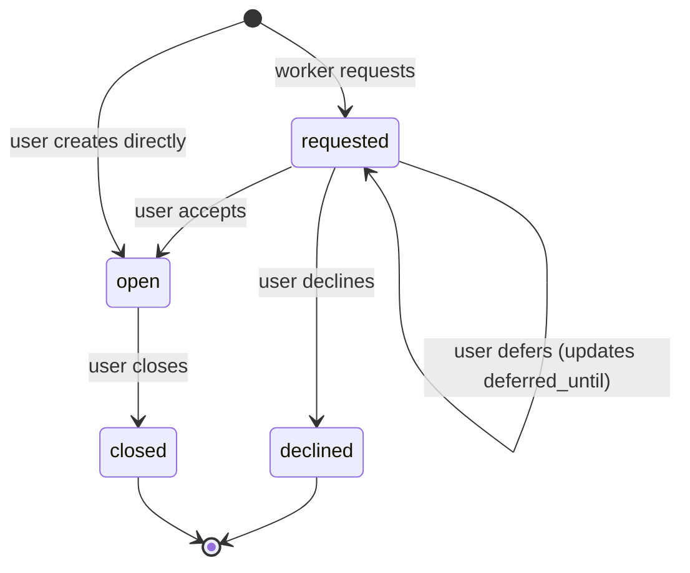
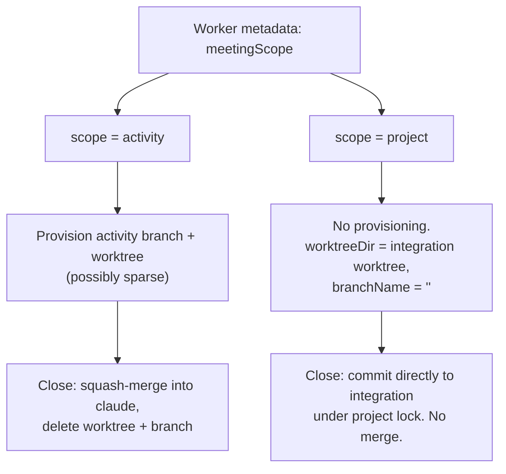
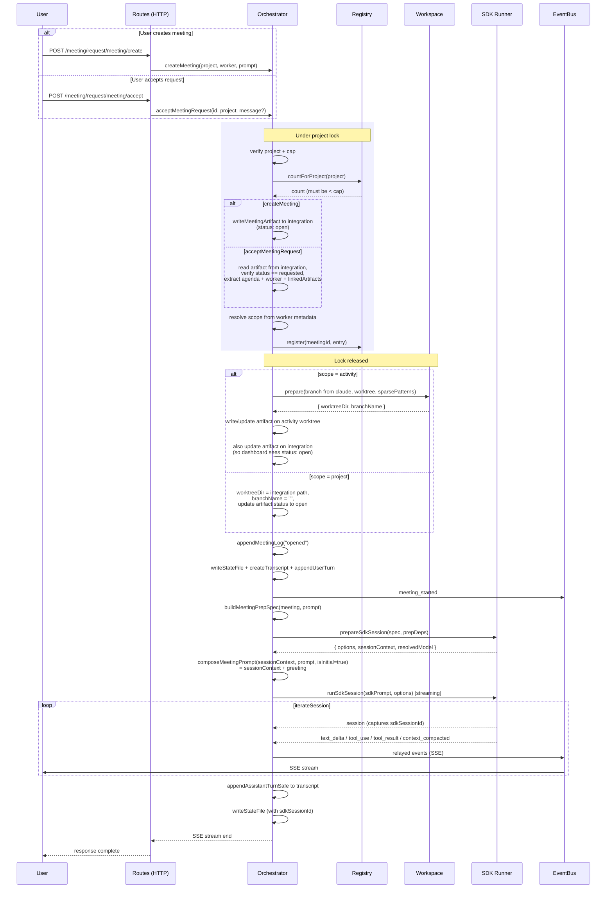
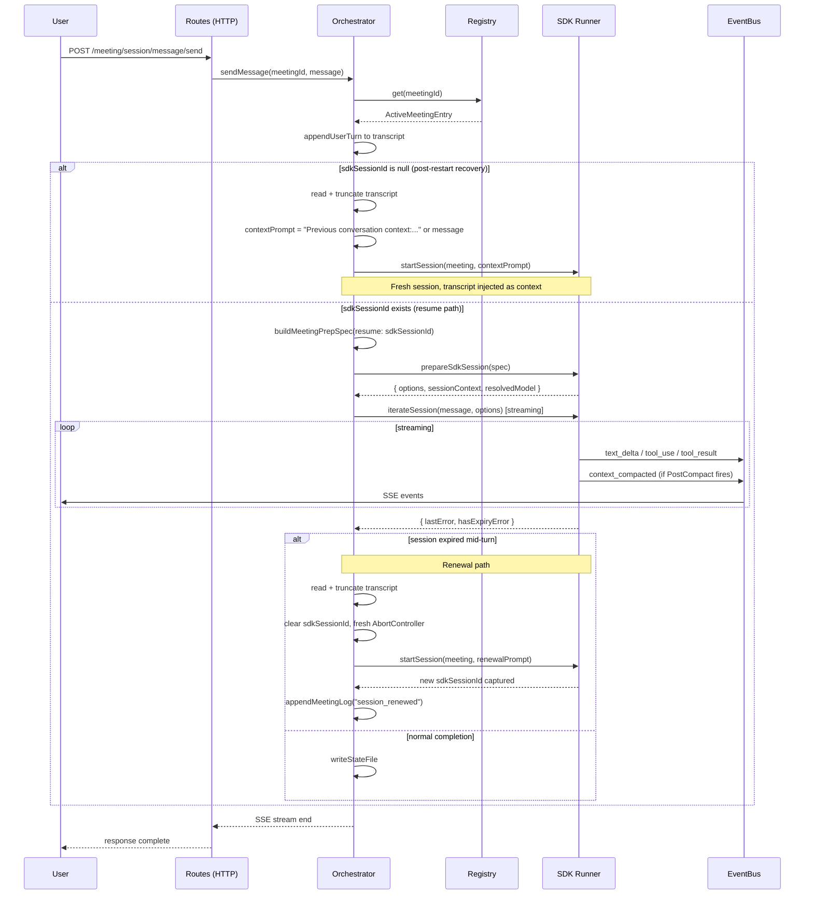
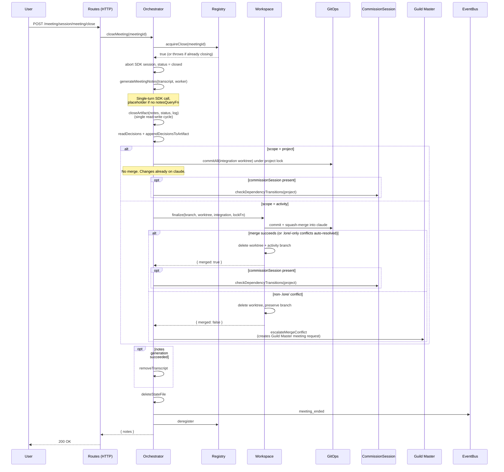
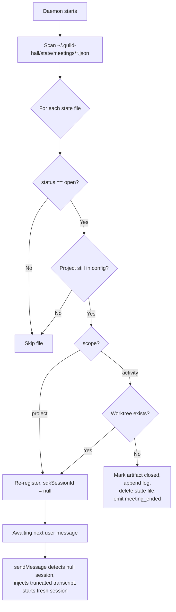
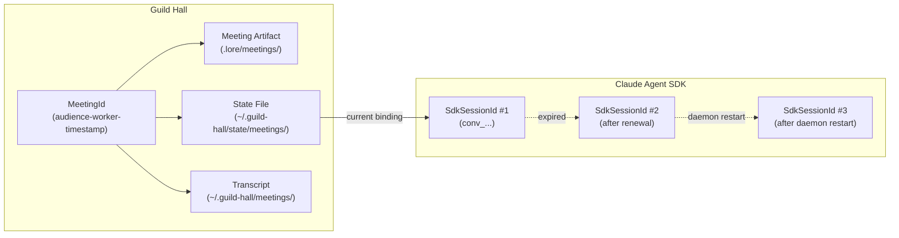

# Diagram: Meeting Lifecycle

## Context

Meetings are synchronous, multi-turn interactions between a user and a worker. Unlike commissions (fire-and-forget), meetings stream responses in real time and persist conversation state across SDK sessions. This diagram answers: how does a meeting move from creation to close, what happens during each turn, and how does crash recovery restore state?

Two cross-cutting dimensions matter throughout the lifecycle:

- **Scope.** Each worker declares a `meetingScope` of `"project"` or `"activity"` (default). Activity-scoped meetings get their own git branch and worktree; project-scoped meetings run directly on the integration worktree under the project lock.
- **Two ID namespaces.** `MeetingId` is Guild Hall's identifier and survives the meeting's lifetime. `SdkSessionId` is the Claude Agent SDK's `session_id` and may be replaced by renewal or daemon restart.

## State Machine

Four states. Two entry paths (user-initiated skips `requested`). Two terminal states.

### State Ownership

| State | Who triggers the transition |
|-------|---------------------------|
| requested | Worker or Guild Master writes meeting artifact via `createMeetingRequest` |
| open | User (`createMeeting` or `acceptMeetingRequest`) |
| closed | User (`closeMeeting`) |
| declined | User (`declineMeeting`) |

## Meeting Scope

`meetingScope` is read from worker metadata at creation time and stored on the registry entry. It determines branch/worktree provisioning at open and merge behavior at close.

The Guild Master / manager worker is the canonical project-scoped worker today. All other shipped workers default to activity scope.

## Create and Accept Flow

Two paths into `open`. User-created meetings skip the request phase entirely; accepted meetings read an existing artifact from the integration worktree. Both paths run cap enforcement and registration under a project lock, then leave the lock for workspace provisioning and the SDK session.

On any error after registration, `cleanupFailedEntry` deregisters the entry, removes the activity worktree, and deletes the activity branch only if it has no commits beyond `claude`. Branches with work are preserved for manual recovery.

## Multi-Turn Conversation

Each user message is a new HTTP request. The SDK session is resumed when possible, renewed when expired, and started fresh when the daemon restarted.

`iterateSession` returns `{ lastError, hasExpiryError }` so the orchestrator can detect expiry post-loop. Expiry errors are suppressed from SSE during the resume path so the user never sees them; renewal kicks in transparently. All errors (including suppressed ones) are persisted to the transcript via `appendErrorSafe`.

`context_compacted` events flow through both as SSE events (so the UI can show a marker) and as transcript entries. When the PostCompact hook delivers a summary after the boundary event has already been processed, the post-loop pass appends it to the transcript.

## Close Meeting

User-initiated close. Notes generation, artifact close, decision persistence, scope-aware finalization, dependency unblocking, cleanup.

`closeArtifact` writes notes, flips status to closed, and appends the close log entry in a single read-write cycle so the artifact never observes a partial close. Decision persistence reads the in-flight decisions log and appends a structured Decisions section so the artifact captures judgment calls made during the meeting.

`checkDependencyTransitions` is the unblocking hook for commissions: when a meeting closes and adds artifacts to `claude`, blocked commissions whose dependencies just became satisfied move to ready. It runs after a successful merge (activity scope) or after the direct commit (project scope).

## Crash Recovery

On daemon restart, open meetings are re-registered with null session IDs. The next user message starts a fresh SDK session with transcript context. Activity-scoped meetings whose worktree has gone missing are closed as stale.

Project-scoped meetings skip the worktree existence check because the integration worktree is always present.

## Two ID Namespaces

One meeting can have multiple SDK sessions over its lifetime. These IDs must never be mixed.

## Reading the Diagram

The state machine is small (four states, two terminal) because meetings are user-driven. The user opens, the user closes. Workers can request meetings, but only users can accept them.

The sequence diagrams show the three HTTP operations that drive the lifecycle: create/accept (opens), message (each turn), close (finalizes and cleans up). Each operation is a separate request/response with SSE streaming for real-time events. The session loop is split between `prepareSdkSession` (resolves tools, activates the worker, builds options and `sessionContext`) and `iterateSession` (drives the streaming generator and accumulates transcript data); `composeMeetingPrompt` chooses what gets sent to the SDK based on whether this is the initial turn, a renewal, or a post-restart resume.

The crash recovery flowchart shows the pessimistic approach: SDK sessions are inherently transient, so after a restart, all sessions are lost. The transcript file provides continuity by feeding prior conversation into a fresh session. Activity-scoped meetings whose worktree is gone get closed deterministically rather than left in limbo.

## Key Insights

- **Scope dictates git topology.** Activity scope gets its own branch + worktree and squash-merges to `claude` at close. Project scope runs on the integration worktree under the project lock and commits directly. Most workers are activity-scoped; the manager / Guild Master is project-scoped.
- **No background execution.** Unlike commissions, meetings never run without the user watching. Every SDK call is triggered by a user action (create, accept, message, close-time notes generation). This makes the lifecycle simpler but adds the session persistence challenge.
- **Session renewal is transparent.** Expiry errors are suppressed from SSE during the resume path; the orchestrator detects them post-loop, starts a fresh session with truncated transcript context, and appends a `session_renewed` log entry. The user sees no interruption.
- **Concurrent close guard prevents double cleanup.** `acquireClose()` returns false (or throws on a re-entry attempt) if a close is already in progress, preventing the race between error-triggered and user-initiated closes from executing cleanup twice.
- **Transcript survives merge failures.** If notes generation fails, the transcript is preserved so the user can manually review the conversation. It's only deleted after successful notes generation.
- **Cap enforcement is atomic.** The count check, artifact write (for `createMeeting`), and registration happen under a project lock, preventing two concurrent create/accept calls from both passing the cap check.
- **Closing a meeting can unblock commissions.** `checkDependencyTransitions` runs after the artifact lands on `claude` (project scope) or after a successful squash-merge (activity scope), moving commissions whose dependencies just became satisfied into ready.
- **Compaction is observable.** `context_compacted` events surface to the UI as SSE events and are recorded in the transcript so a returning reader can see where the SDK compacted history. PostCompact hook summaries arrive separately and are reconciled against the boundary event.

## Not Shown

- **Meeting toolbox details.** Workers have meeting-specific tools (`link_artifact`, `propose_followup`, `summarize_progress`, plus manager-only commission tools). Tool resolution and composition happen inside `prepareSdkSession` via `resolveToolSet`.
- **Notes generation internals.** How the transcript is summarized into meeting notes (decisions, artifacts produced, action items) and the placeholder fallback when no `notesQueryFn` is wired.
- **Decline and defer flows.** These are simple artifact updates on the integration worktree with no workspace, git, or SDK involvement. Defer rewrites the `deferred_until` field in YAML frontmatter via byte splice (gray-matter `stringify` reformats and is avoided here).
- **EventBus subscription lifecycle.** How SSE clients subscribe, receive events, and reconnect.
- **Worker activation and memory loading.** The shared `activateWorker` helper, manager context construction, and how `loadMemories` hangs off `prepareSdkSession`.
- **Integration worktree lock contention.** Project-scoped meetings, activity-scoped close-time merges, and commission finalization all share the project lock.

## Related

- `.lore/work/specs/meetings/guild-hall-meetings.md` for requirements and REQ IDs
- `.lore/work/specs/meetings/project-scoped-meetings.md` for the scope dimension
- `.lore/work/specs/meetings/meeting-context-compaction.md` for the compaction event flow
- `.lore/work/specs/meetings/meeting-error-persistence.md` for transcript error handling
- `.lore/work/specs/infrastructure/daemon-application-boundary.md` for system-level architecture
- `.lore/reference/activities/commission-lifecycle.md` for the commission equivalent
- `apps/daemon/services/meeting/orchestrator.ts` for the orchestration implementation
- `apps/daemon/services/meeting/registry.ts` for cap enforcement and close guard
- `apps/daemon/services/meeting/session-loop.ts` for `startSession` / `iterateSession` / `composeMeetingPrompt`
- `apps/daemon/services/meeting/record.ts` for `closeArtifact` and artifact log helpers
- `apps/daemon/services/workspace.ts` for git isolation and squash-merge
- `apps/daemon/lib/agent-sdk/sdk-runner.ts` for `prepareSdkSession` / `runSdkSession`
