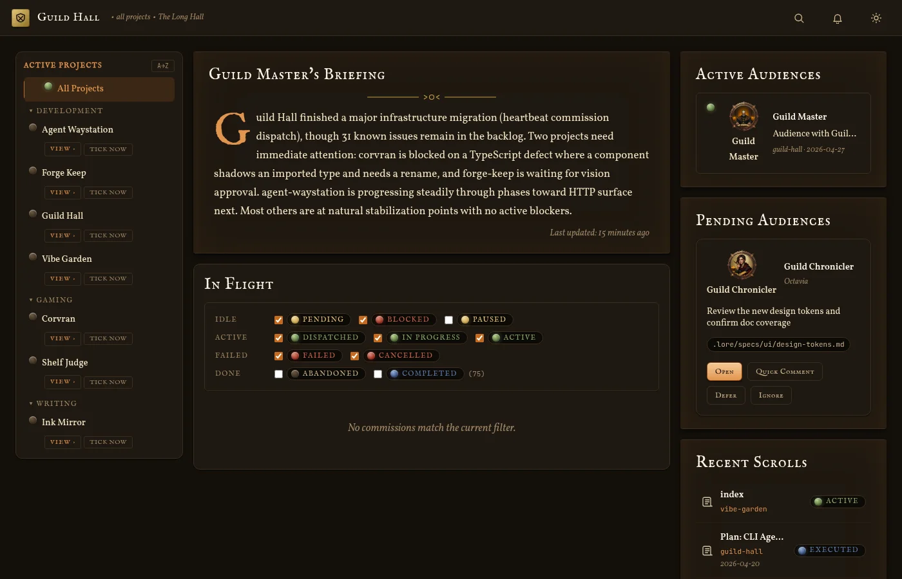

# Guild Hall Usage Guide

Guild Hall is a workspace for coordinating AI specialists around a real project. The product flow is straightforward:

1. Run Guild Hall locally.
2. Register a project that already has `.git/` and `.lore/`.
3. Browse artifacts and project status from the dashboard.
4. Hold live audiences with workers when you need an interactive conversation.
5. Dispatch commissions when you want asynchronous work to run in the background.

## Guide map

| Guide | What it covers |
| --- | --- |
| [`getting-started.md`](./getting-started.md) | Installation, local startup, project registration, and the first things to look for in the UI |
| [`dashboard-and-projects.md`](./dashboard-and-projects.md) | The dashboard, project hub, artifact browsing, and artifact detail pages |
| [`meetings-and-audiences.md`](./meetings-and-audiences.md) | Pending audiences, live meeting flows, linked artifacts, and closing a meeting |
| [`commissions.md`](./commissions.md) | Creating one-shot or scheduled commissions, dependencies, overrides, and commission monitoring |

## Core terms

| Term | Meaning |
| --- | --- |
| Artifact | A Markdown document inside a project's `.lore/` tree |
| Audience / Meeting | A live, interactive session with a specialist worker |
| Commission | An asynchronous task assigned to a worker |
| Guild Master briefing | A dashboard summary generated for the selected project |
| Pending audience | An incoming worker request waiting for you to open, defer, ignore, or redirect |

## Recommended reading order

If you are new to Guild Hall, start with [`getting-started.md`](./getting-started.md), then read [`dashboard-and-projects.md`](./dashboard-and-projects.md). After that, choose between [`meetings-and-audiences.md`](./meetings-and-audiences.md) and [`commissions.md`](./commissions.md) depending on whether you prefer live collaboration or background delegation.

## Code references

- Dashboard route: [`web/app/page.tsx`](../../web/app/page.tsx)
- Project route: [`web/app/projects/[name]/page.tsx`](../../web/app/projects/[name]/page.tsx)
- Artifact route: [`web/app/projects/[name]/artifacts/[...path]/page.tsx`](../../web/app/projects/[name]/artifacts/[...path]/page.tsx)
- Meeting route: [`web/app/projects/[name]/meetings/[id]/page.tsx`](../../web/app/projects/[name]/meetings/[id]/page.tsx)
- Commission route: [`web/app/projects/[name]/commissions/[id]/page.tsx`](../../web/app/projects/[name]/commissions/[id]/page.tsx)
- CLI entrypoint: [`cli/index.ts`](../../cli/index.ts)
