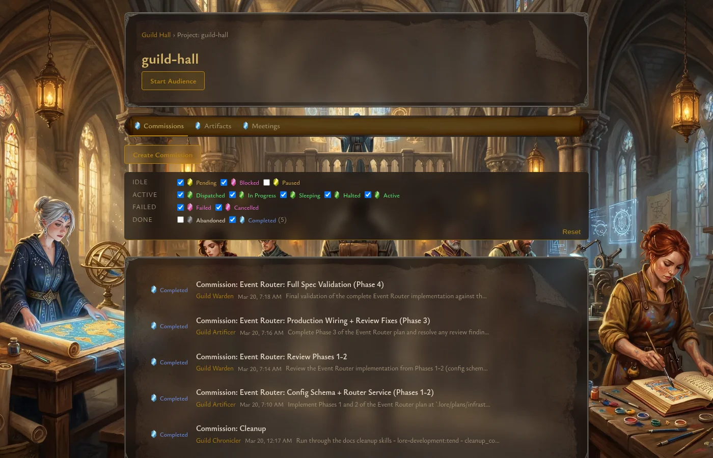
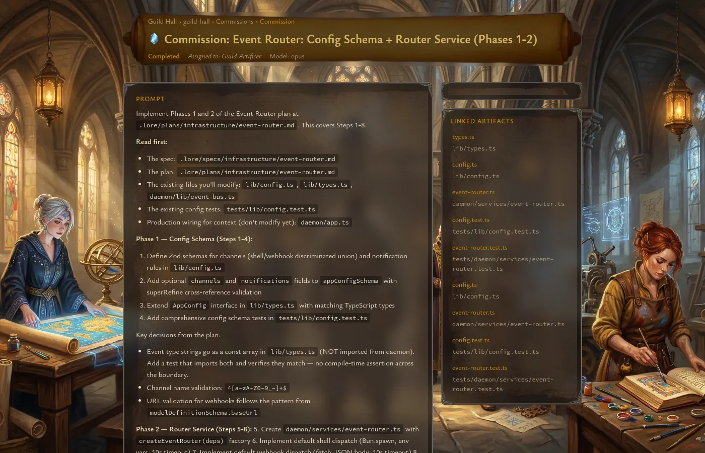

# Commissions

Commissions are Guild Hall's asynchronous work unit. You create them when you want a worker to execute a scoped task without keeping a live chat open.

## Where commissions live

Each project has a `Commissions` tab that combines creation, status filtering, and the current commission list. Commissions are listed with their title, assigned worker, date, and a prompt preview.

A multi-select status filter groups commissions by lifecycle stage (Idle, Active, Failed, Done), with gem-colored checkboxes and counts. The filter defaults to actionable statuses so completed and abandoned commissions stay out of the way unless you ask for them.

## Creating a commission

The inline create form supports both one-shot and scheduled commissions.

For a **one-shot** commission, fill in:

- `Title`
- `Worker`
- `Prompt`
- optional `Dependencies`

For a **scheduled** commission, add:

- `Cron Expression`
- optional `Repeat Count`

You can also expand **Resource Overrides** to set a `Model` override, including local models when configured.

Dependencies are entered as comma-separated artifact paths. Guild Hall also provides a shortcut from artifact detail pages that opens the commission form with the current artifact pre-filled as a dependency.

## Following commission progress

The commission detail page is designed for monitoring work as it unfolds.

A commission page typically includes:

- a header with title, status, assigned worker, and model information
- a neighborhood graph showing direct dependencies and dependents
- the original prompt
- a timeline of status changes and progress updates
- manager notes
- linked artifacts produced or referenced by the work

For scheduled commissions, the sidebar also shows schedule information such as the cron description, next run, last run, and recent spawned runs.

## Live updates

Active commissions subscribe to event updates so the page can reflect status changes, progress reports, results, and newly linked artifacts without a full manual refresh.

This makes commission detail pages the best place to watch long-running work move from `queued` or `dispatched` into `in_progress` and finally into a terminal state.

## When to use a commission instead of an audience

Choose a commission when:

- the task can be described clearly up front
- you want progress recorded as a timeline
- the work may need dependencies
- the task should recur on a schedule

Choose an audience when you expect a conversation rather than a handoff.

## Code references

- Project commissions tab: [`web/app/projects/[name]/page.tsx`](../../web/app/projects/[name]/page.tsx)
- Create commission button: [`web/components/commission/CreateCommissionButton.tsx`](../../web/components/commission/CreateCommissionButton.tsx)
- Commission form: [`web/components/commission/CommissionForm.tsx`](../../web/components/commission/CommissionForm.tsx)
- Commission detail route: [`web/app/projects/[name]/commissions/[id]/page.tsx`](../../web/app/projects/[name]/commissions/[id]/page.tsx)
- Commission header: [`web/components/commission/CommissionHeader.tsx`](../../web/components/commission/CommissionHeader.tsx)
- Commission live view: [`web/components/commission/CommissionView.tsx`](../../web/components/commission/CommissionView.tsx)
