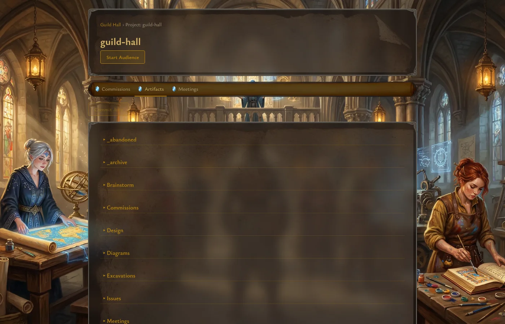
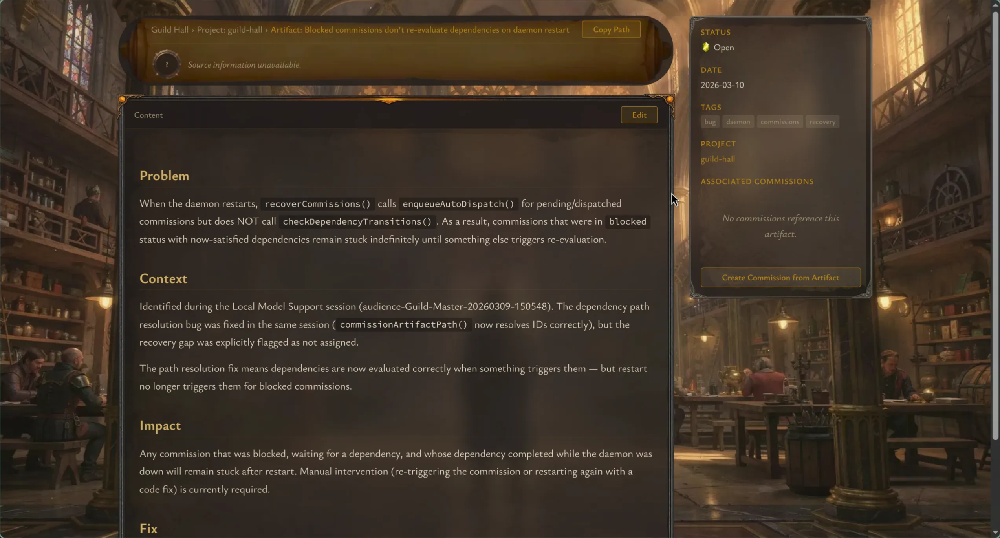

# Dashboard, Projects, and Artifacts

This guide covers the parts of Guild Hall you will use for orientation: the main dashboard, a project's tabbed hub, and the artifact browser.

## Dashboard overview

The dashboard is the top-level workspace view. It pulls together the current state of all registered projects, then emphasizes the currently selected one.

The dashboard defaults to an **All Projects** view that synthesizes status across every registered project. Selecting a project in the sidebar switches to a project-specific view with a focused briefing.

The main panels are:

- **Workspace sidebar** for switching between registered projects (or back to All Projects)
- **Guild Master briefing** for a readable project summary (multi-project synthesis in All Projects mode, project-specific when one is selected)
- **In Flight** for filtering and monitoring active commissions, with multi-select status checkboxes grouped by lifecycle stage (Idle, Active, Failed, Done)
- **Recent Scrolls** for quick access to the latest commissions across projects
- **Pending Audiences** for meeting requests that need your attention

The pending audience panel is especially useful when workers are requesting direction. From there, you can open the audience immediately, defer it, ignore it, or turn it into a quick-comment commission flow.

## Project hub

Selecting a project opens a dedicated project page with three tabs:

- `Artifacts`
- `Commissions`
- `Meetings`

The tabs are stable entry points into the project's `.lore/` content and active work.

## Artifact browsing

The artifact tab renders the project's `.lore/` tree as a navigable list, with a `.lore` breadcrumb path at the top. Files appear inside expandable directories, and each artifact shows its title, date, tags, and a gem-style status badge.

A **Commit .lore** button at the top of the Artifacts tab lets you commit pending `.lore/` changes directly from the web UI with a user-authored message, without switching to the terminal.

A few practical notes:

- Artifacts are read from the integration worktree by default.
- Open meeting and commission artifacts are resolved from their active worktrees when needed.
- Status is visualized with gem indicators so incomplete, active, blocked, and completed items are easy to scan.
- Images referenced in artifacts render inline with proper scaling.

## Artifact detail pages

Opening an artifact gives you a full reading view plus a metadata sidebar.

The detail page includes:

- breadcrumb-style provenance back to the project
- rendered Markdown content (including inline images)
- metadata such as status, date, tags, modules, and related artifacts
- associated commissions that reference the artifact
- a shortcut for creating a commission from the current artifact
- a **Request Meeting** button with a worker picker, pre-filling the artifact as context

If the artifact is an open meeting file, the page also shows a direct `View Meeting` link back to the live audience.

## When to stay on the dashboard vs. open a project

Use the dashboard when you want situational awareness across projects or a quick entry into pending work.

Open the project hub when you want to:

- browse the full artifact tree
- review all meetings for one project
- create or monitor commissions in context

## Code references

- Dashboard route: [`apps/web/app/page.tsx`](../../apps/web/app/page.tsx)
- Pending audiences panel: [`apps/web/components/dashboard/PendingAudiences.tsx`](../../apps/web/components/dashboard/PendingAudiences.tsx)
- Project hub route: [`apps/web/app/projects/[name]/page.tsx`](../../apps/web/app/projects/[name]/page.tsx)
- Project tabs: [`apps/web/components/project/ProjectTabs.tsx`](../../apps/web/components/project/ProjectTabs.tsx)
- Artifact list: [`apps/web/components/project/ArtifactList.tsx`](../../apps/web/components/project/ArtifactList.tsx)
- Artifact detail route: [`apps/web/app/projects/[name]/artifacts/[...path]/page.tsx`](../../apps/web/app/projects/[name]/artifacts/[...path]/page.tsx)
- Metadata sidebar: [`apps/web/components/artifact/MetadataSidebar.tsx`](../../apps/web/components/artifact/MetadataSidebar.tsx)
