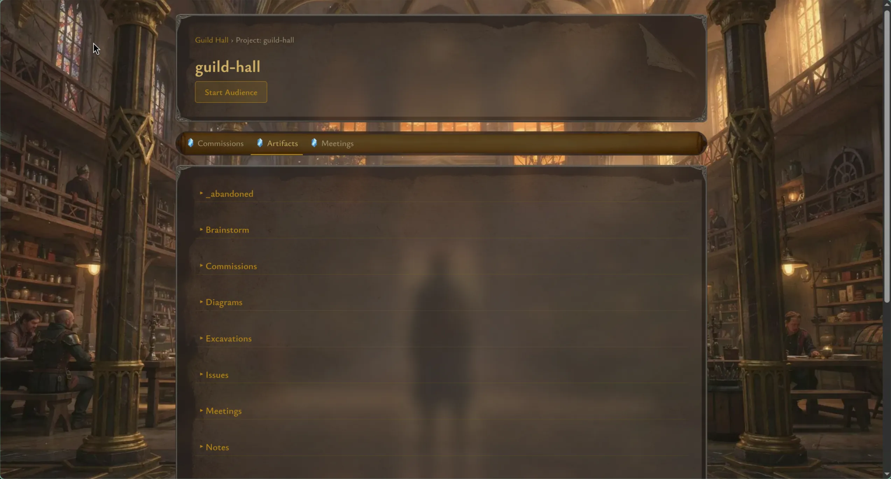

# Getting Started

Guild Hall works best when you already have a project repository and a `.lore/` directory that holds project artifacts. Once those exist, the local setup is short.

## 1. Install dependencies

```bash
bun install
```

## 2. Start the app

```bash
bun run dev
```

This starts both the daemon and the Next.js web UI. Open `http://localhost:3000` after the processes are ready.

## 3. Register a project

```bash
bun run guild-hall register my-project /path/to/project
```

The target path must already contain:

- a `.git/` directory
- a `.lore/` directory

Guild Hall uses the registered project name throughout the UI, including the workspace sidebar, project pages, meetings, and commissions.

## 4. Optional maintenance commands

```bash
bun run guild-hall validate
bun run guild-hall rebase my-project
bun run guild-hall sync my-project
```

Use `validate` to confirm the local configuration is healthy. Use `rebase` and `sync` when you are maintaining Guild Hall's integration branches for a project.

## 5. What you should see first

After registration, the dashboard becomes the main landing page. It defaults to an All Projects view. Selecting a project in the sidebar drives the Guild Master briefing, In Flight commissions, and project-specific navigation.


From there, click a project in the workspace sidebar to open its project hub.



## First-session checklist

- Confirm your project appears in the workspace sidebar.
- Open the project hub and switch between `Artifacts`, `Commissions`, and `Meetings`.
- Open an artifact to verify `.lore/` content is being read correctly.
- Check whether any pending audiences are already waiting on the dashboard.

## Code references

- Root README setup section: [`README.md`](../../README.md)
- CLI commands: [`apps/cli/index.ts`](../../apps/cli/index.ts)
- Dashboard route: [`web/app/page.tsx`](../../web/app/page.tsx)
- Project route: [`web/app/projects/[name]/page.tsx`](../../web/app/projects/[name]/page.tsx)
