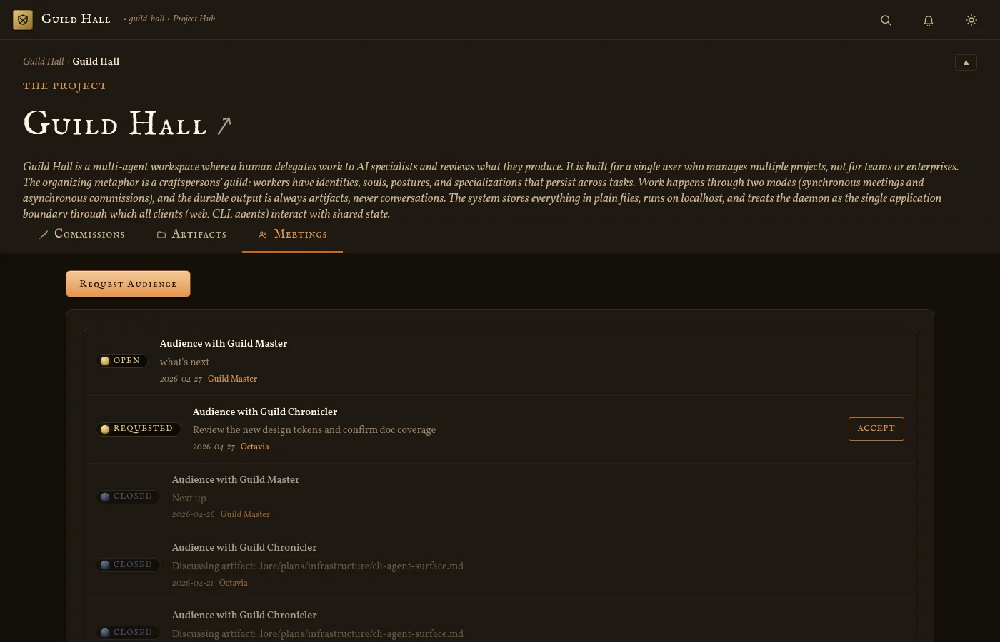
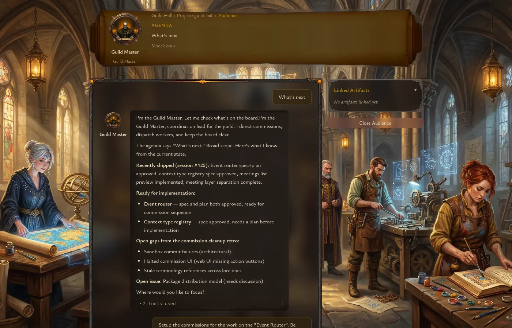
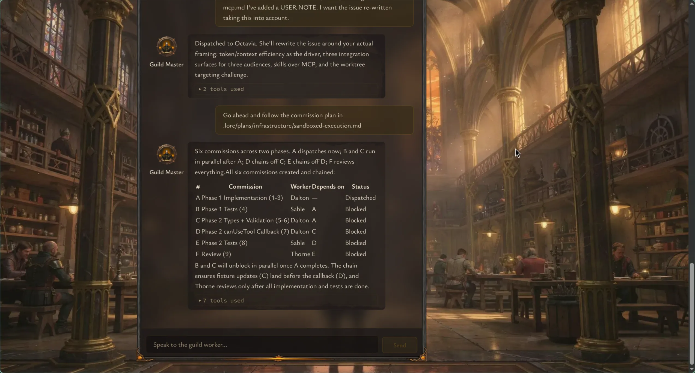

# Meetings and Audiences

Guild Hall uses the word **audience** for a live meeting with a worker. In practice, the UI uses both terms: the project tab is called `Meetings`, while the dashboard panel is called `Pending Audiences`.

## Starting from pending audiences

New worker requests show up on the dashboard as cards in the `Pending Audiences` panel.

Each card can include:

- the worker identity and portrait
- the meeting agenda
- linked artifacts
- a deferred-until badge when the request was postponed

From the card, you can choose one of four actions:

- **Open** to accept the audience and jump into the live meeting
- **Defer** to schedule it for a later date
- **Ignore** to decline it
- **Quick Comment** to write a prompt that becomes a commission instead

## Meetings tab

Inside a project, the `Meetings` tab shows the audience history for that project. Each entry includes the meeting title, status gem, agenda or notes preview, date, and worker name. A **Request Meeting** button at the top lets you start a new audience directly from the project view.

## Live meeting view

Opening an audience takes you to a dedicated meeting page. The header shows the project, worker, agenda, and model information. The main layout combines a chat area with a sidebar for linked artifacts and the close action.

As the session continues, the lower portion of the page keeps the linked artifacts visible and lets you close the audience when the conversation is complete.

## What happens when you close an audience

Closing a meeting ends the live interaction and transitions the UI to a notes display. That gives you a clean handoff back to the project once the audience is finished.

If you later open the meeting artifact from the project, Guild Hall can route you back to the live audience while it is still open.

## Best use cases for audiences

Use an audience when you need:

- back-and-forth clarification
- fast exploration with a specialist worker
- a conversation that might link new artifacts while it runs

If the work is better described as a standalone task with a durable lifecycle, use a commission instead.

## Code references

- Pending audience card actions: [`apps/web/components/dashboard/MeetingRequestCard.tsx`](../../apps/web/components/dashboard/MeetingRequestCard.tsx)
- Meeting route: [`apps/web/app/projects/[name]/meetings/[id]/page.tsx`](../../apps/web/app/projects/[name]/meetings/[id]/page.tsx)
- Meeting view composition: [`apps/web/components/meeting/MeetingView.tsx`](../../apps/web/components/meeting/MeetingView.tsx)
- Project hub route: [`apps/web/app/projects/[name]/page.tsx`](../../apps/web/app/projects/[name]/page.tsx)
